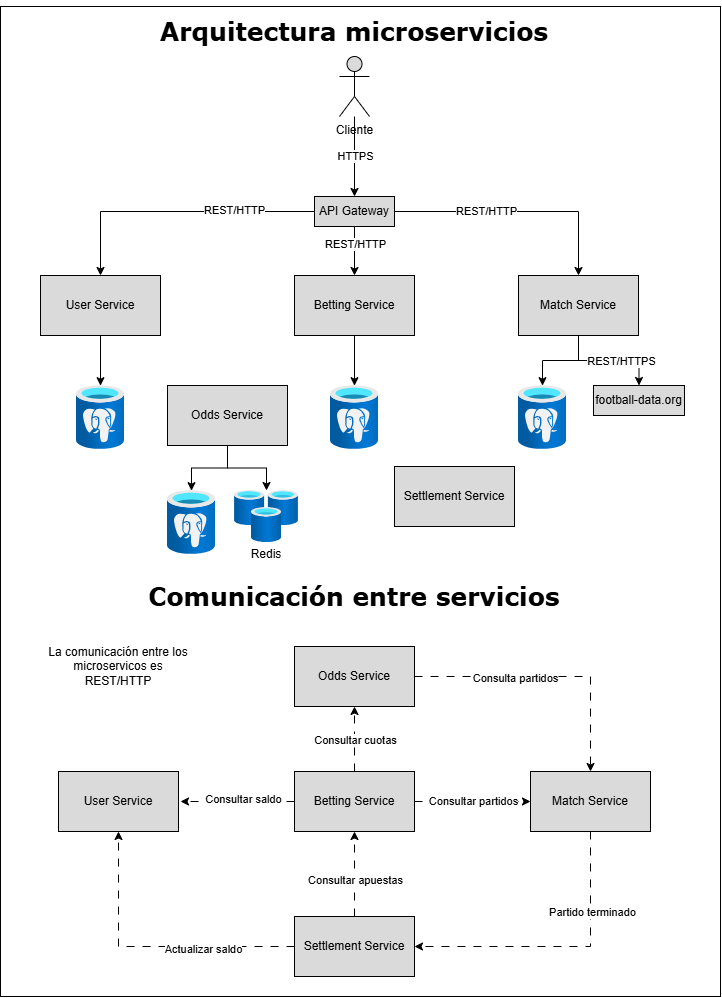

# PracticasCC-Plataforma-de-apuestas-deportivas-BETESP

## Descripcion del dominio
BETESP es una aplicación cloud-native de predicciones deportivas que permite a los usuarios realizar pronósticos sobre los partidos de los equipos de la Primera División Espanola en las competiciones de LaLiga EA Sports y la Champions League, utilizando un saldo virtual.

### Actores
- Usuarios
- Administradores
- Sistema de resultados

### Conceptos principales del dominio
- Usuarios
- Competiciones
- Partidos
- Equipos
- Resultados 
- Cuotas
- Predicciones
- Saldo

## Casos de uso principales
### CU-01 Registrar Usuario
El usuario accede a la web y se crea una cuenta introduciendo su correo y contraseña. La aplicación comprueba que los datos introducidos son válidos y crea la cuenta del nuevo usuario.
### CU-02 Consultar partidos
El usuario consulta los proximos partidos de equipos españoles en las competiciones de LaLiga y la Champions.
### CU-03 Consultar Cuotas y Predicciones
El usuario puede consultar las predicciones y cuotas del partido seleccionado.
### CU-04 Realizar Prediccion
El usuario puede realizar predicciones sobre uno o varios partidos utilizando su saldo virtual disponible.
### CU-05 Gestionar Saldo
El usuario puede gestionar su saldo, ver cuanto tiene disponible, retirar o depositar más saldo.
### CU-06 Gestionar Usuarios
El administrador puede gestionar a los usuarios que se han registrado en la aplicación.
### CU-07 Gestionar Partidos, predicciones y cuotas
El administrador puede gestionar los partidos, las predicciones y las cuotas correspondientes.
### CU-08 Gestionar resultados.
El sistema va a pagar el sueldo a los ganadores de las predicciones al obtener el resultado final de los partidos.
### CU-09 Notificar resultados
El sistema notificará a los usuarios de los resultados de sus apuestas.

## Justificacion NIST SP 800-145
La utilización de una infraestructura cloud para BETESP permite disponer de los recursos necesarios de forma dinámica, facilitando el acceso a la plataforma y adaptando su capacidad a las variaciones de demanda, especialmente durante partidos de gran interés.

El uso de cloud computing está justificado por la naturaleza variable de la carga de BETESP. La actividad de los usuarios no será constante, ya que se espera una mayor demanda antes y durante los partidos y, especialmente, en los encuentros de mayor interés, como pueden ser los partidos de Champions o de los grandes equipos en LaLiga. Una infraestructura tradicional para los picos de demanda supondría mantener recursos infrautilizados durante los periodos de baja actividad. De esta forma, el modelo cloud proporciona flexibilidad, escalabilidad y un mejor aprovechamiento de los recursos frente a una infraestructura estática.
### Acceso amplio a la red
BERESP será accesible mediante Internet utilizando protocolos y mecanismos estándar, principalmente HTTPS para la comunicación con los clientes y REST/HTTP para la comunicación entre servicios. Esto permite que la plataforma pueda ser utilizada desde diferentes dispositivos y ubicaciones, es decir, los usuarios podrán hacer sus apuestas de forma ubicua.
### Autoservicio bajo demanda
BETESP permite a los usuarios acceder y utilizar sus funcionalidades bajo demanda a través de Internet, sin que sea necesaria la intervención manual del proveedor para cada operación. La aplicación estará disponible independientemente del número de usuarios utilizándola.
### Rápida elasticidad
BETESP presenta una demanda variable, especialmente durante partidos de gran interés (Barça vs. Real Madrid). La arquitectura basada en microservicios permite escalar horizontalmente aquellos servicios que reciban una mayor carga, sin necesidad de replicar toda la aplicación. De esta forma, los recursos pueden aumentar durante periodos de alta demanda y reducirse posteriormente, manteniendo siempre la disponibilidad para nuestros usuarios.
### Agrupación
Los recursos computacionales del proveedor se ponen en común para servir a múltiples consumidores. BETESP no necesita disponer de servidores físicos dedicados, sino que utiliza recursos virtualizados proporcionados por el proveedor cloud.
### Servicio medido
Los recursos utilizados por la aplicación pueden ser monitorizados y medidos mediante las herramientas del proveedor cloud. Esto permite conocer el consumo de CPU, memoria, almacenamiento, tráfico de red y otros recursos, facilitando tanto la monitorización del sistema como el control de costes. El modelo de pago por uso permite adaptar el gasto a la utilización real de la plataforma.

## Mapeo de Actores NIST SP 500-292
### Consumidor
El consumidor es el equipo de BETESP, ya que utiliza los recursos proporcionados por el proveedor para ejecutar los microservicios y ofrecer la aplicación a sus usuarios.
### Proveedor
El proveedor cloud será responsable de proporcionar y mantener la infraestructura necesaria para ejecutar BETESP. Como posible proveedor se plantea Azure, aunque la arquitectura está diseñada para poder desplegarse sobre otros proveedores cloud.
### Intermediario
No se contempla un intermediario, ya que BETESP consumirá directamente los servicios del proveedor cloud.
### Auditor
Al ser un proyecto académico, este rol no va a ser cumplido por ninguna entidad externa de ningun tipo. Se intentará cumplir el rol mediante la monitorización y observabilidad que se esperan añadir más adelante en el proyecto.
### Operador
El operador es el mismo equipo de BETESP, encargado de desplegar, configurar, monitorizar y mantener los componentes de la aplicación sobre la infraestructura cloud.
### Impacto económico
La utilización de servicios cloud permite reducir la inversión inicial necesaria para desplegar BETESP, ya que no es necesario adquirir servidores físicos, sistemas de almacenamiento ni infraestructura de red propia. El coste estará relacionado principalmente con los recursos utilizados por la aplicación. Esto permite adaptar el gasto al tamaño y utilización real de la plataforma.

En cuanto a los roles de Intermediario y Auditor, BETESP no contempla inicialmente la contratación de servicios externos asociados a estas funciones. Al consumir directamente los servicios del proveedor cloud, se evita incorporar un intermediario que no aportaría un valor significativo a las necesidades actuales del proyecto. Del mismo modo, no se considera necesaria la contratación de un auditor externo, ya que las tareas de monitorización, control y evaluación del sistema pueden cubrirse mediante las herramientas proporcionadas por la propia infraestructura cloud y los mecanismos internos de supervisión. Esta decisión permite reducir costes.
## Diagrama de Arquitectura


BETESP se desarrollará siguiendo una arquitectura distribuida basada en microservicios. El cliente accederá a la plataforma a través de un API Gateway, utilizando el protocolo HTTPS. El Gateway actuará como punto de entrada a la aplicación y será responsable de dirigir las peticiones hacia el microservicio correspondiente.

Los microservicios estarán desarrollados utilizando Java y Spring Boot y expondrán interfaces REST para las operaciones que requieran comunicación síncrona. Los datos se almacenarán de forma desacoplada, de manera que cada microservicio será responsable de su propia persistencia mediante una base de datos PostgreSQL, evitando que un servicio acceda directamente a la base de datos de otro.

No todos los microservicios estarán expuestos directamente al cliente. Los servicios User Service, Match Service y Betting Service proporcionarán las principales funcionalidades accesibles por los usuarios a través del API Gateway. Los servicios Odds Service y Settlement Service estarán orientados principalmente a proporcionar lógica interna necesaria para el funcionamiento de la plataforma.
### User Service
El User Service será responsable de gestionar la información relacionada con los usuarios de BETESP. Entre sus principales responsabilidades se encuentran el registro de usuarios, la gestión de sus datos y la administración del saldo virtual utilizado para realizar las predicciones.
### Betting Service
El Betting Service será el encargado de gestionar las predicciones realizadas por los usuarios y contendrá una parte importante de la lógica de negocio de BETESP. Antes de registrar una predicción, este servicio deberá comprobar que el partido existe y que todavía se encuentra disponible para realizar predicciones. También deberá consultar la cuota correspondiente y verificar que el usuario dispone de saldo virtual suficiente. La cuota utilizada en cada predicción se almacenará junto con ella para garantizar que una modificación posterior de las cuotas no afecte a una predicción ya realizada.
### Match Service
El Match Service será responsable de gestionar toda la información relacionada con las competiciones, equipos y partidos deportivos. Este servicio actuará como adaptador entre BETESP y la API externa football-data.org. Será el único microservicio encargado de comunicarse directamente con dicha API, obteniendo y normalizando la información deportiva antes de almacenarla en la base de datos de BETESP.
### Odds Service
El Odds Service será responsable de gestionar las cuotas utilizadas por BETESP. Las cuotas serán generadas y administradas por la propia aplicación mediante una lógica de negocio definida para el proyecto, sin depender directamente de un proveedor externo de cuotas. Este servicio podrá utilizar información proporcionada por el Match Service, como los equipos participantes y otros datos deportivos, para calcular o actualizar las cuotas. Además, se utilizará Redis como sistema de caché para almacenar temporalmente las cuotas más consultadas y reducir el número de accesos a la base de datos.
### Settlement Service
El Settlement Service será responsable de liquidar las predicciones una vez que un partido haya finalizado. Cuando el Match Service detecte que un partido ha terminado, le notificará al Settlement Service. El Settlement Service determinará qué predicciones asociadas al partido son ganadoras o perdedoras. Para realizar la liquidación, el servicio consultará las predicciones registradas en el Betting Service y utilizará el resultado final proporcionado por el Match Service. 

Para la comunicación entre Match Service y Settlement Service puede plantearse el uso de RabbitMQ para que la comunicación sea asíncrona. La comunicación síncrona mediante REST se utilizará para operaciones que requieren una respuesta inmediata, mientras que RabbitMQ se puede emplear para la comunicación basada en eventos, como la notificación de la finalización de un partido al Settlement Service. Esta separación permite reducir el acoplamiento entre microservicios y procesar determinados eventos de forma independiente y resiliente. Además, aporta la ventaja de que en un futuro podrían plantearse nuevos microservicios como uno de notificación de los resultados o uno estadístico, los cuales dependerían de los eventos generados por Match Service para sus funciones.
## Endpoints principales de API REST

La API utilizará JSON como formato de intercambio de información.

### User Service

El User Service gestiona los usuarios y su saldo virtual.

#### Registrar usuario

```http
POST /users
Content-Type: application/json
```

Payload:

```json
{
  "username": "juan123",
  "email": "juan@example.com",
  "password": "********"
}
```

Respuesta:

```json
{
  "id": 15,
  "username": "juan123",
  "email": "juan@example.com"
}
```

#### Consultar usuario

```http
GET /users/{id}
```

Ejemplo:

```http
GET /users/15
```

Respuesta:

```json
{
  "id": 15,
  "username": "juan123",
  "email": "juan@example.com"
}
```

#### Consultar saldo virtual

```http
GET /users/{id}/balance
```

Respuesta:

```json
{
  "userId": 15,
  "balance": 1000.00,
  "currency": "VIRTUAL"
}
```

---

### Match Service

El Match Service gestiona competiciones, equipos y partidos, además de sincronizar la información deportiva procedente de football-data.org.

#### Consultar partidos

```http
GET /matches
```

Se podrán utilizar parámetros para filtrar los resultados, por ejemplo:

```http
GET /matches?date=2026-10-20&status=SCHEDULED
```

Respuesta:

```json
[
  {
    "id": 123,
    "competition": "Primera División",
    "homeTeam": "Real Madrid",
    "awayTeam": "Barcelona",
    "date": "2026-10-20T20:00:00",
    "status": "SCHEDULED"
  }
]
```

#### Consultar un partido

```http
GET /matches/{id}
```

Ejemplo:

```http
GET /matches/123
```

Respuesta:

```json
{
  "id": 123,
  "competition": "Primera División",
  "homeTeam": "Real Madrid",
  "awayTeam": "Barcelona",
  "date": "2026-10-20T20:00:00",
  "status": "FINISHED",
  "homeGoals": 2,
  "awayGoals": 1
}
```

---

### Betting Service

El Betting Service contiene la lógica principal relacionada con las predicciones de los usuarios.

#### Realizar una predicción

```http
POST /bets
Content-Type: application/json
```

Payload:

```json
{
  "userId": 15,
  "matchId": 123,
  "prediction": "HOME_WIN",
  "amount": 100
}
```

Antes de registrar la predicción, el Betting Service comprobará:

1. Que el partido existe.
2. Que el partido todavía no ha comenzado.
3. Que el mercado está abierto.
4. Que existe una cuota válida.
5. Que el usuario dispone de saldo suficiente.

Respuesta:

```json
{
  "betId": 456,
  "userId": 15,
  "matchId": 123,
  "prediction": "HOME_WIN",
  "amount": 100,
  "odds": 2.10,
  "potentialWin": 210.00,
  "status": "OPEN"
}
```

La cuota utilizada se almacenará junto con la predicción para garantizar que posteriores cambios en las cuotas no modifiquen una predicción ya realizada.

#### Consultar las predicciones de un usuario

```http
GET /users/{userId}/bets
```

Ejemplo:

```http
GET /users/15/bets
```

Respuesta:

```json
[
  {
    "betId": 456,
    "matchId": 123,
    "prediction": "HOME_WIN",
    "amount": 100,
    "odds": 2.10,
    "status": "OPEN"
  }
]
```

#### Consultar una predicción

```http
GET /bets/{id}
```

Ejemplo:

```http
GET /bets/456
```

Respuesta:

```json
{
  "betId": 456,
  "userId": 15,
  "matchId": 123,
  "prediction": "HOME_WIN",
  "amount": 100,
  "odds": 2.10,
  "status": "WON",
  "payout": 210.00
}
```

---

### Odds Service

El Odds Service gestiona las cuotas utilizadas por la plataforma. Este servicio será principalmente de uso interno y no estará necesariamente expuesto directamente al cliente.

#### Consultar cuotas de un partido

```http
GET /odds/matches/{matchId}
```

Ejemplo:

```http
GET /odds/matches/123
```

Respuesta:

```json
{
  "matchId": 123,
  "markets": {
    "HOME_WIN": 2.10,
    "DRAW": 3.40,
    "AWAY_WIN": 3.20
  }
}
```

El Betting Service utilizará este endpoint para obtener la cuota vigente antes de registrar una nueva predicción.

---

### Settlement Service

El Settlement Service no tendrá como objetivo principal exponer endpoints directamente al cliente. Su funcionamiento estará basado principalmente en eventos.

Cuando el Match Service detecte que un partido ha finalizado, publicará un evento `MatchFinished` mediante RabbitMQ.

Evento:

```json
{
  "event": "MatchFinished",
  "matchId": 123,
  "homeGoals": 2,
  "awayGoals": 1
}
```

El Settlement Service consumirá este evento y realizará las siguientes operaciones:

1. Obtener las predicciones asociadas al partido.
2. Determinar el resultado del partido.
3. Identificar las predicciones ganadoras y perdedoras.
4. Calcular las ganancias virtuales.
5. Actualizar el saldo de los usuarios.
6. Marcar las predicciones como liquidadas.